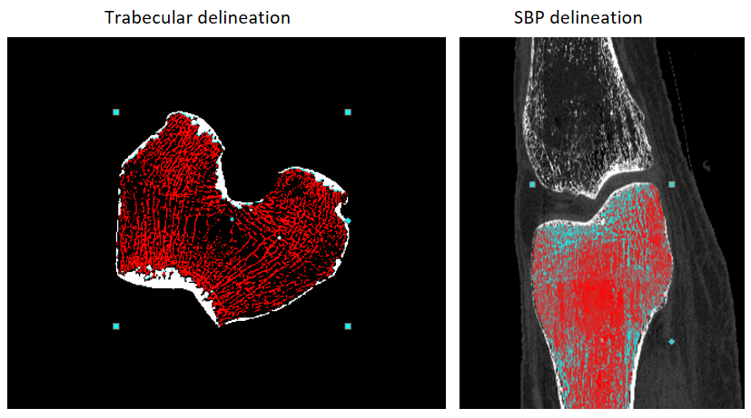
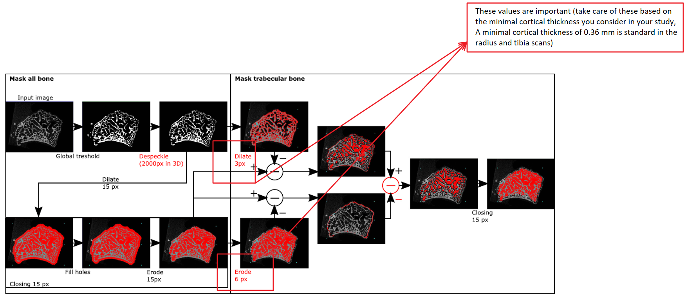

### How to automatically segment trabecular and cortical bone in CT scans, using CTAn.
Developed by [Fahimeh Azari](https://github.com/fahimehazari) based on [morphological escalator](./Bruker-method-note.pdf) and dual thresholding technique [1]. 

### Overview of two Methods:
There are various techniques for separating trabecular from cortical bone using automated image processing that can be effective. One method, called the morphological escalator, is executed in a series of steps in the CTAn custom processing page. This method includes three phases: first, a "shrink-wrap" process to establish the bone boundary; second, an inverse thresholding to convert the medullary space into a binary image; and third, a series of morphological operations known as the "morphological escalator" to further refine the image.

The process of automatically creating the trabecular volume of interest (VOI) involves three steps:
1. A "shrink-wrap" distance transform operation is used to establish a boundary around the bone's periphery at the periosteum or outer cortical structures.
2. Inverse binarization is applied to the medulla cavity and cortical porosity, while excluding surrounding areas. 
3. A series of opening and closing operations known as the "morphological escalator" are performed with a gradually increasing pixel radius to consolidate the binarized medullary space into a continuous volume, eliminating trabecular structures and removing cortical pores and peripheral artifacts. The resulting shape corresponds to the medulla and can be used as the trabecular VOI.

Custom processing task list to delineate the boundary of medullary trabecular bone from surrounding cortical bone in the human distal femur in photon counting CT (PCCT) scans. 

### Implementing the morphological escalator method:
1. Download the CTAn custom processing [task list](./morphological-escalator-task-list.ctt) and move it to your data set. This will enable you to access the task list from CTAn.
2. Open the data set in CTAn and go to the custom processing preview.
3. Import the task list in the task list tab and run it.
4. Now, you have trabecular and cortical delineation. If you open the data set again and go to the region of interest preview and load any of these delineations as the region of interest, you can see trabecular or cortical boundaries and do further processing.

#### How to get THE subchondral bone plate (SBP):
1. Implement the same method but in the coronal view to get the delineation of cortical bone.
2. Indicate the top region of the joint as the region of interest to get the SBP.
 
In Figure 1, you can see the segmentation of trabecular bone in the transaxial view and SBP in the coronal view. 

<!--
Figure 1. Automatic determination of the trabecular bone and SBP based on morphological escalator method.-->

### Implementing the dual thresholding technique method:
You can replicate the same protocol as the morphological escalator Method in CTAn using this [task list](./dual%20thresholding-task-list.ctt), but you need to adapt some parameter is shown in the following figure 2 [2] based on your application. 

Figure 2. Automatic determination of the trabecular bone based on dual thresholding method.

- If you have any questions about the workflow, or if anything in the guide is unclear, please create an Issue in this github repository or contact me at: <a href="fahimeh.azari@kuleuven.be">fahimeh.azari@kuleuven.be</a> 

#### References:
[1] Buie, Helen R., et al. "Automatic segmentation of cortical and trabecular compartments based on a dual threshold technique for in vivo micro-CT bone analysis." Bone 41.4 (2007): 505-515.
 
[2] Mys, Karen, et al. "Quantification of bone microstructure in the wrist using cone-beam computed tomography." Bone 114 (2018): 206-214.
